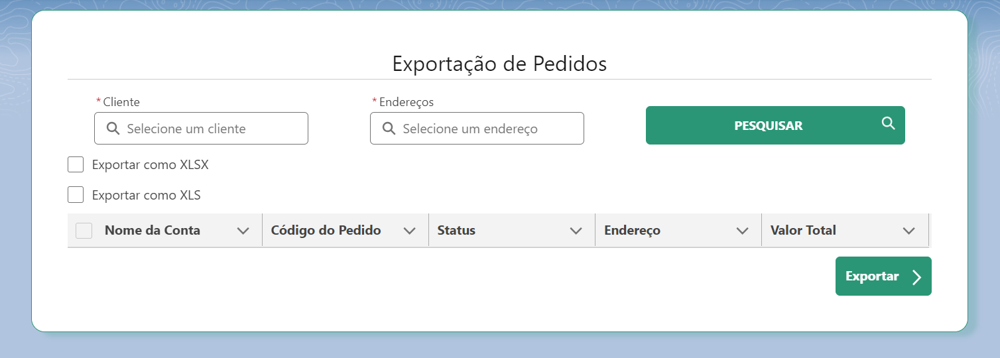

# Exporting Data With LWC - Salesforce
Simples projeto desenevolvido no CRM Salesforce onde foi desenvolvido a funcionalidade de exportação de dados de registros de pedidos (Order) em formato de planilhas excel (xls ou xlsx) a partir de uma tela customizada feita com Lightning Web Components.

### Componentes de Lightning Web Components
1 - Lookup: Componente de pesquisa de registros localizados na base de dados da org;

2 - ExportData: Componente principal que incorpora a maioria das funcionalidade como também o componente de pesquisa.

### Biblioteca Externa
Foi utilizado a biblioteca externa [write-excel-file](https://www.npmjs.com/package/write-excel-file) de JavaScript para criar o arquivo xlsx.

### Classes Apex
- Classe de busca para o componente de Lookup que realiza a query de acordo com os parametros determinados dentro do componente de LWC;
- Classe Controller desenvolvida em Apex para buscar e retornar os registros de pedidos de acordo com os dados que vieram a partir do componente de LWC.

### Classes de Teste
1 - Classe de teste para Lookup class

2 - Classe de teste para ExportDataController class

### Visualização da tela customizada

